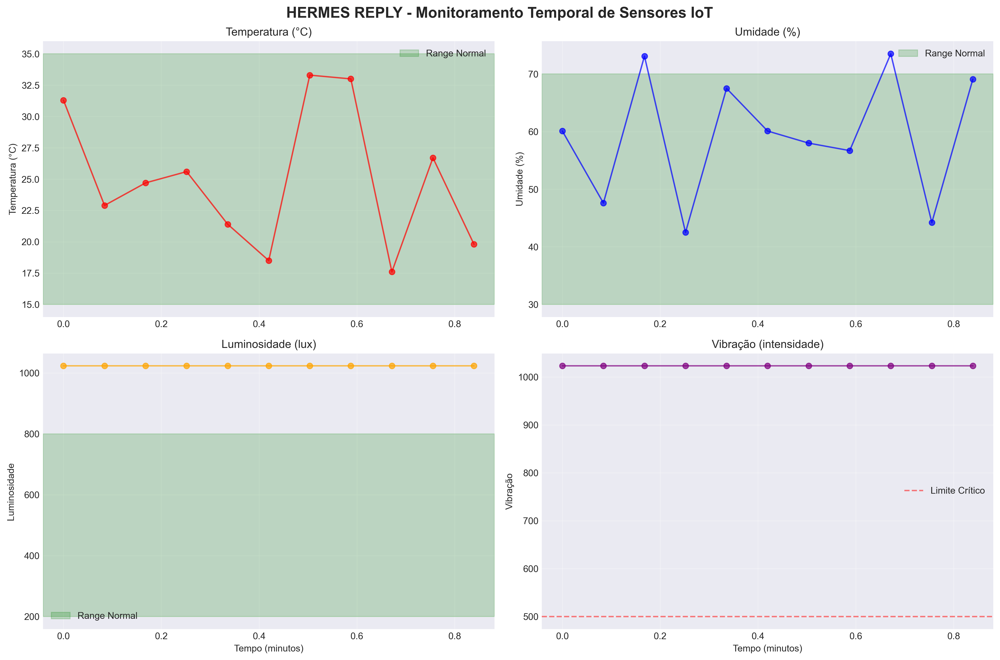
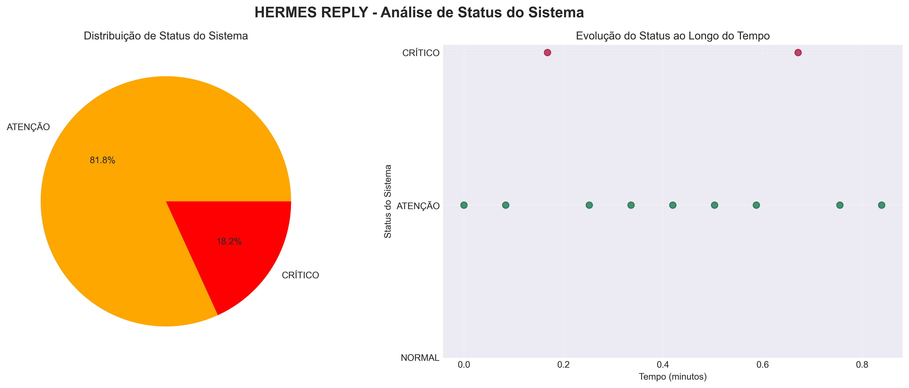
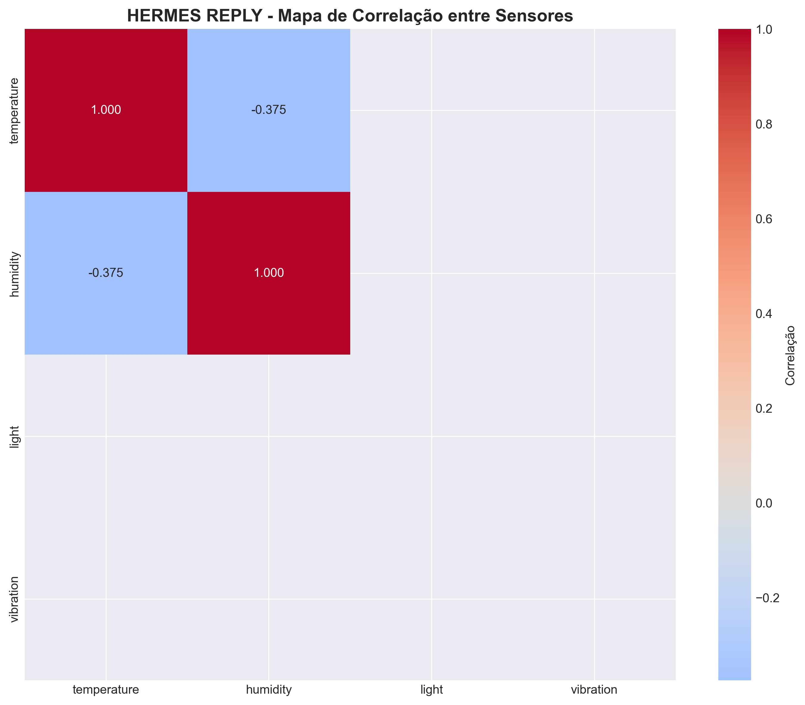
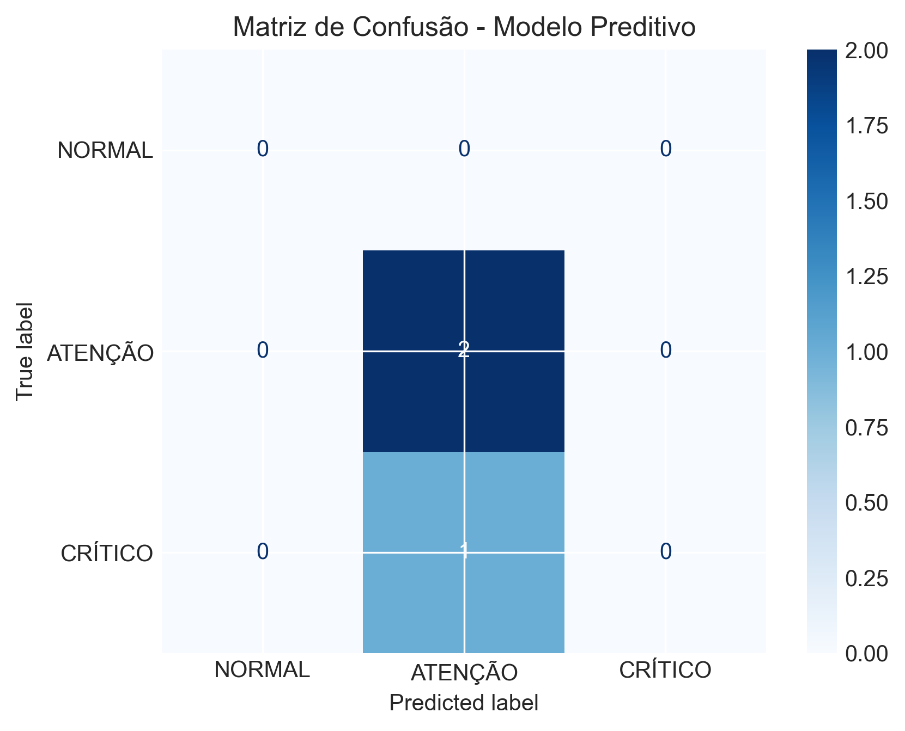
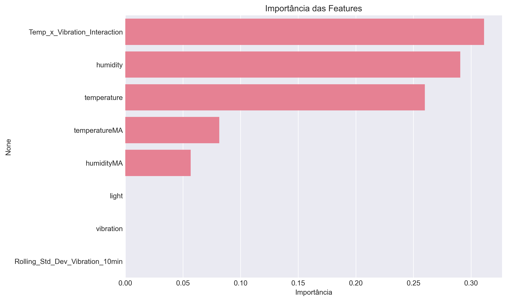

# Relatório de Análise IoT - Hermes Reply
Este relatório resume os resultados da análise de dados, do modelo preditivo e das principais descobertas.
## Visão Geral
- Total de registros: 11
## Gráficos Gerados

